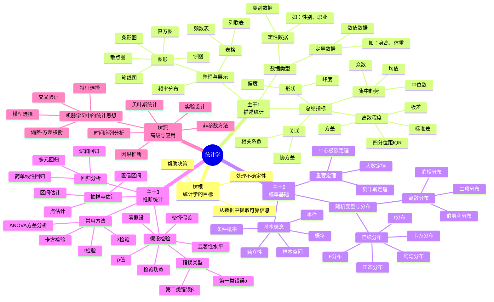

# 统计学完整知识地图

```mermaid
mindmap
    root((统计学))
        树根<br/>统计学的目标
            从数据中提取可靠信息
            处理不确定性
            帮助决策
        主干1<br/>描述统计
            数据类型
                定性数据
                    类别数据
                    如：性别、职业
                定量数据
                    数值数据
                    如：身高、体重
            整理与展示
                表格
                    频数表
                    列联表
                频率分布
                图形
                    直方图
                    箱线图
                    散点图
                    饼图
                    条形图
            总结指标
                集中趋势
                    均值
                    中位数
                    众数
                离散程度
                    方差
                    标准差
                    极差
                    四分位距IQR
                形状
                    偏度
                    峰度
                关联
                    协方差
                    相关系数
        主干2<br/>概率基础
            基本概念
                样本空间
                事件
                概率
                条件概率
                独立性
            重要定理
                贝叶斯定理
                大数定律
                中心极限定理
            随机变量与分布
                离散分布
                    伯努利分布
                    二项分布
                    泊松分布
                连续分布
                    均匀分布
                    正态分布
                    t分布
                    卡方分布
                    F分布
        主干3<br/>推断统计
            抽样与估计
                点估计
                区间估计
                置信区间
            假设检验
                零假设
                备择假设
                p值
                显著性水平
                错误类型
                    第一类错误α
                    第二类错误β
                检验功效
            常用方法
                z检验
                t检验
                卡方检验
                ANOVA方差分析
            回归分析
                简单线性回归
                多元回归
                逻辑回归
        树冠<br/>高级与应用
            非参数方法
            时间序列分析
            贝叶斯统计
            实验设计
            因果推断
            机器学习中的统计思想
                偏差-方差权衡
                交叉验证
                模型选择
                特征选择
```

> 使用说明：将以上代码粘贴到 [Mermaid Live Editor](https://mermaid.live) 或支持 Mermaid 的 Markdown 编辑器中查看思维导图。使用"Markdown增强预览“工具打开预览
